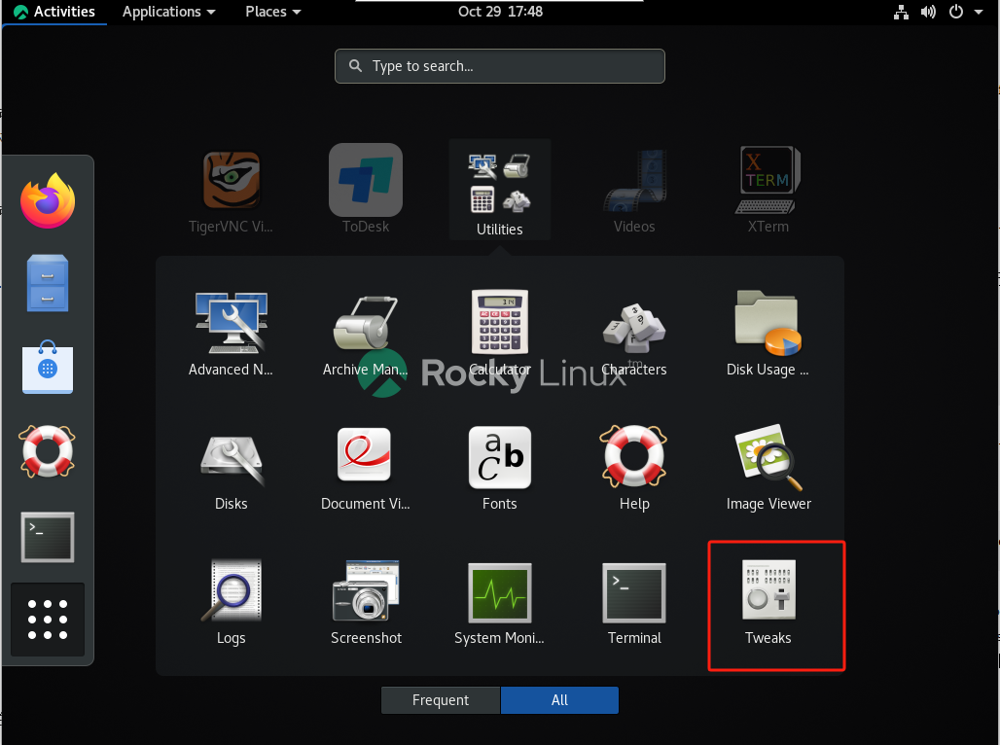
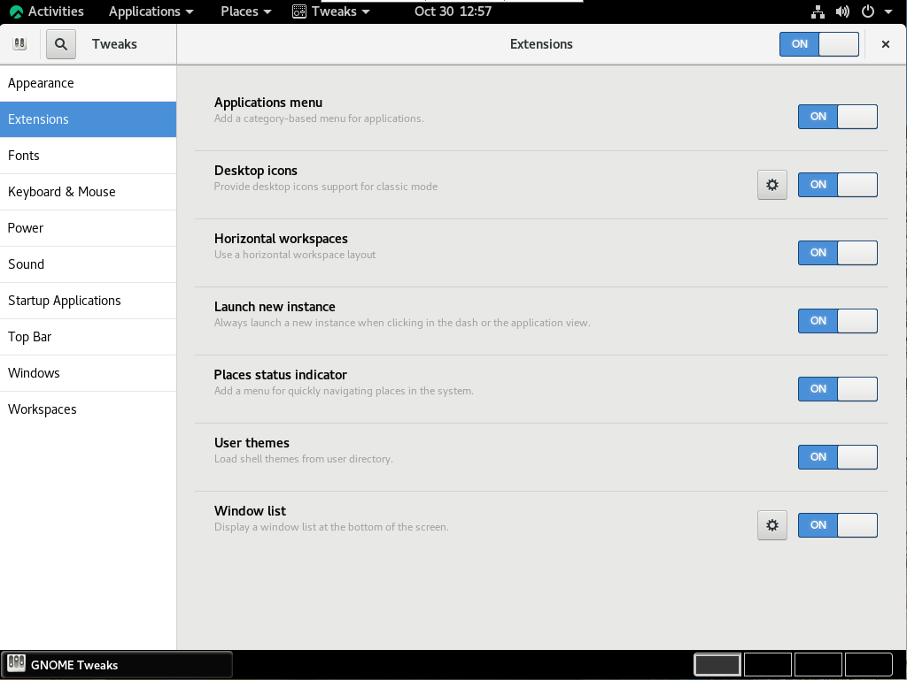
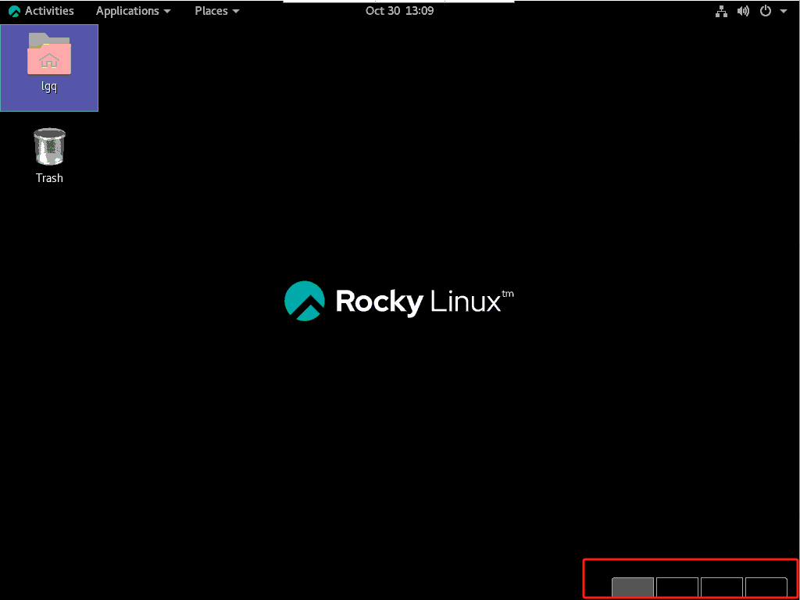
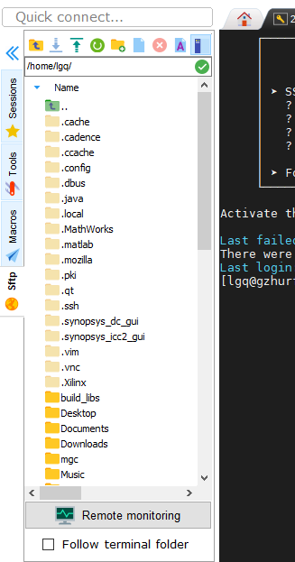

## 直接在线看就行
## 1 新建账号(需要root权限) 
 - 在/Public目录下有一个Makefile脚本(可以copy仓库下的Makefile)
>cd /Public
- 查看用户对应的vnc端口
> cat /etc/tigervnc/vncserver.users
 - 以创建名字为lgq，并配置vnc端口为17(选最大的端口，没用过的)为例，执行以下命令创建用户并自动开启vnc
>sudo make create_user name=lgq vnc_port=17 
>

<<<<<<< HEAD
=======
>make vnc_config  name=lgq vnc_port=17
- 重启vnc端口号
  sudo make vnc_restart vnc_port=17
>
>>>>>>> a378a1cc18a941266355d96c92b7e78f86aa946b
 - 注意：vnc_port不要比/etc/tigervnc/vncserver.users文件里面原来最大的端口号小，主要是因为防火墙的端口范围
## 2 新建账号以后的一些设置
 - 新建账户以后桌面如下

 - 打开tweak在里面设置即可

 - 其他设置自己灵活发挥

 - 设置好以后一般如下

 - 右下角四个框框是workplace设置，请自己找一下
## 3 logout问题
**以下这种情形就是寄了，目前暂时也只能备份文件，重建了**

**另外正常使用不要点logout，这很麻烦。目前暂时只能备份文件，新建账号了**
## 4 update问题(需要root权限)
最好不要update，不确定会不会出问题
## 5 .bashrc（一般是软件环境变量问题）
 - 如果发现某些需要的软件安装了但是用不了，请检查一下~/.bashrc文件有没有设置对应的环境变量，可以看看/Public下的.bashrc。
 - 如果/Public下的.bashrc没有的话，看一下软件安装目录，结合google或者百度，照猫画虎配置一下。
 - 更换软件版本（如果有不同的版本）也是一样，注释掉原来的环境变量，修改成新版本的软件的路径。
 - 例如：
- 
 - 修改完成以后source ~/.bashrc
## 6 VNC端口更换(应该是需要root)
 -  可以查看/Public下makefile中vnc_config下的命令，查看防火墙设置端口。
 - [防火墙设置(一篇博客)](https://blog.csdn.net/qq_42055933/article/details/142604671 "")
## 7 文件传输或备份问题
 - MobaXterm软件 ssh登录服务器(软件使用敬请google或百度)
- 
 - scp传输(工位网络上传可以达到100MB):[scp命令传文件](https://blog.csdn.net/a545812327/article/details/111313810)
注意scp传去自己账户有权限的目录下，博客是以root用户示范的
- 其他办法敬请google或百度
## 8连接服务器问题
- 推荐[VNC Viewer by RealVNC](https://www.realvnc.com/en/connect/download/viewer/?lai_vid=99JdlQ1wyirn&lai_sr=10-14&lai_sl=l)
可以不登录，可以直接使用
- [Windows下通过VNC Viewer访问Linux服务器](https://blog.csdn.net/shao_yc/article/details/103300402)
点开直接看4就可以(如何打开像4的界面：上方菜单栏->file->new connection)。
 - 其他办法敬请google或百度
## 9双击文件夹无法打开，右键无法打开终端(需要root权限)
- 一直转圈
  
- 解决办法：重启vnc端口号，替换为自己对应的端口号（也可以用makefile）
> sudo systemctl restart vncserver@:自己端口号.service
 
